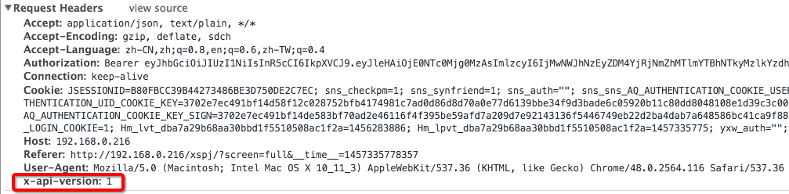

# 前后端分离之 RESTful API 设计指南


经过『学生成长档案』、『新高考选课』以及『陕西教育资源平台』等项目前后端分离实践，积累了一定的 RESRful API 设计经验，遂将之整理为本文档。

- 本文档主要目的是为设计接口时提出建议，使大家不必重复造 HTTP 协议已经完成的轮子，其次规避之前在 接口设计中所遇到的错误和缺陷，以及借鉴前人优秀的设计和经验;
- 文档中若有错误或者未提及部分，烦请指出以便更正。


###1. API 域名、前缀

一般地，数字校园项目 API 地址前缀为：`该项目名（上下文）+ /api`。如：

```
  http://192.168.0.216/xspj/api/grades  (学生评价项目获取年级列表);
  http://192.168.12.217/xgk/api/periods (新高考选科获取所有届)；
```

### 2. API 版本

因当前 API 设计还未涉及太多版本问题， 暂时将 API 版本置于请求 header 头内，字段为" x-api-version",版本为 1，如下图：



服务器端应该检测 API 请求版本，若 Request headers 没有 `x-api-version` 应该拒绝请求，版本错误应进行相应处理。


## 3. 路径

路径又称"终点"（endpoint），表示API的具体网址。

在RESTful架构中，每个网址代表一种资源（resource），所以网址中不能有动词，只能有名词，而且所用的名词往往与数据库的表格名对应。一般来说，数据库中的表都是同种记录的"集合"（collection），所以API中的名词也应该使用复数。

举例来说，有一个API提供动物园（zoo）的信息，还包括各种动物和雇员的信息，则它的路径应该设计成下面这样。


```
https://api.example.com/v1/zoos
https://api.example.com/v1/animals
https://api.example.com/v1/employees
```


## 4. HTTP 请求方法

关于方法语义的说明：

- `GET` 用于从服务器获取某个资源的信息
  + 完成请求后返回状态码 `200 OK`
  + 完成请求后需要返回被请求的资源详细信息
- `POST` 用于创建资源
  + 创建完成后返回状态码 `201 Created`
  + 完成请求后需要返回被创建的资源详细信息
- `PUT` 用于完整的替换资源或者创建指定身份的资源，比如创建 id 为 123 的某个资源
  + 如果是创建了资源，则返回 `201 Created`
  + 如果是替换了资源，则返回 `200 OK`
  + 完成请求后需要返回被修改的资源详细信息
- `DELETE` 用于删除某个资源
  + 完成请求后返回状态码 `204 No Content`
- `PATCH` 用于局部更新资源
  + 完成请求后返回状态码 `200 OK`
  + 完成请求后需要返回被修改的资源详细信息
- `OPTIONS` 用于获取资源支持的所有 HTTP 方法
- `HEAD` 用于只获取请求某个资源返回的头信息

关于方法参数的说明：

* `GET`,`DELETE`,`HEAD` 方法，参数风格为标准的 `GET` 风格的参数，如 `url?a=1&b=2`；
* `POST`,`PUT`,`PATCH`,`OPTION` 方法
  - 默认情况下请求实体会被视作标准 json 字符串进行处理，当然依旧推荐设置头信息的`Content-Type` 为 `application/json`；
  - 在一些特殊的接口中，此时允许`Content-Type` 为 `application/x-www-form-urlencoded` 或者 `multipart/form-data`,此时请求实体会被视作标准 `POST` 风格的参数进行处理。


相关资料：

* [RFC 7231 中对请求方法的定义](http://tools.ietf.org/html/rfc7231#section-4.3)
* [RFC 5789](http://tools.ietf.org/html/rfc5789) - PATCH 方法的定义
* [维基百科](http://zh.wikipedia.org/wiki/%E8%B6%85%E6%96%87%E6%9C%AC%E4%BC%A0%E8%BE%93%E5%8D%8F%E8%AE%AE#.E8.AF.B7.E6.B1.82.E6.96.B9.E6.B3.95)


## 5. 状态码

### 请求成功

* 200 **OK** : 请求执行成功并返回相应数据，如 `GET` 成功
* 201 **Created** : 对象创建成功并返回相应资源数据，如 `POST` 成功；创建完成后响应头中应该携带头标 `Location` ，指向新建资源的地址
* 202 **Accepted** : 接受请求，但无法立即完成创建行为，比如其中涉及到一个需要花费若干小时才能完成的任务。返回的实体中应该包含当前状态的信息，以及指向处理状态监视器或状态预测的指针，以便客户端能够获取最新状态。
* 204 **No Content** : 请求执行成功，不返回相应资源数据，如 `PATCH` ， `DELETE` 成功

### 重定向

**重定向的新地址都需要在响应头 `Location` 中返回**

* 301 **Moved Permanently** : 被请求的资源已永久移动到新位置
* 302 **Found** : 请求的资源现在临时从不同的 URI 响应请求
* 303 **See Other** : 对应当前请求的响应可以在另一个 URI 上被找到，客户端应该使用 `GET` 方法进行请求
* 307 **Temporary Redirect** : 对应当前请求的响应可以在另一个 URI 上被找到，客户端应该保持原有的请求方法进行请求

### 条件请求

* 304 **Not Modified** : 资源自从上次请求后没有再次发生变化，主要使用场景在于实现[数据缓存](#user-content-数据缓存)
* 409 **Conflict** : 请求操作和资源的当前状态存在冲突。主要使用场景在于实现[并发控制](#user-content-并发控制)
* 412 **Precondition Failed** : 服务器在验证在请求的头字段中给出先决条件时，没能满足其中的一个或多个。主要使用场景在于实现[并发控制](#user-content-并发控制)

### 客户端错误

* 400 **Bad Request** : 请求体包含语法错误
* 401 **Unauthorized** : 需要验证用户身份，如果服务器就算是身份验证后也不允许客户访问资源，应该响应 `403 Forbidden`
* 403 **Forbidden** : 服务器拒绝执行
* 404 **Not Found** : 找不到目标资源
* 405 **Method Not Allowed** : 不允许执行目标方法，响应中应该带有 `Allow` 头，内容为对该资源有效的 HTTP 方法
* 406 **Not Acceptable** : 服务器不支持客户端请求的内容格式，但响应里会包含服务端能够给出的格式的数据，并在 `Content-Type` 中声明格式名称
* 410 **Gone** : 被请求的资源已被删除，只有在确定了这种情况是永久性的时候才可以使用，否则建议使用 `404 Not Found`
* 413 **Payload Too Large** : `POST` 或者 `PUT` 请求的消息实体过大
* 415 **Unsupported Media Type** : 服务器不支持请求中提交的数据的格式
* 422 **Unprocessable Entity** : 请求格式正确，但是由于含有语义错误，无法响应
* 428 **Precondition Required** : 要求先决条件，如果想要请求能成功必须满足一些预设的条件

### 服务端错误

* 500 **Internal Server Error** : 服务器遇到了一个未曾预料的状况，导致了它无法完成对请求的处理。
* 501 **Not Implemented** : 服务器不支持当前请求所需要的某个功能。
* 502 **Bad Gateway** : 作为网关或者代理工作的服务器尝试执行请求时，从上游服务器接收到无效的响应。
* 503 **Service Unavailable** : 由于临时的服务器维护或者过载，服务器当前无法处理请求。这个状况是临时的，并且将在一段时间以后恢复。如果能够预计延迟时间，那么响应中可以包含一个 `Retry-After` 头用以标明这个延迟时间（内容可以为数字，单位为秒；或者是一个 [HTTP 协议指定的时间格式](http://tools.ietf.org/html/rfc2616#section-3.3)）。如果没有给出这个 `Retry-After` 信息，那么客户端应当以处理 500 响应的方式处理它。

`501` 与 `405` 的区别是：`405` 是表示服务端不允许客户端这么做，`501` 是表示客户端或许可以这么做，但服务端还没有实现这个功能

相关资料：

* [RFC 里的状态码列表](http://tools.ietf.org/html/rfc7231#page-49)
* [RFC 4918](http://tools.ietf.org/html/rfc4918) - 422 状态码的定义
* [RFC 6585](http://tools.ietf.org/html/rfc6585) - 新增的四个 HTTP 状态码，[中文版](http://www.oschina.net/news/28660/new-http-status-codes)
* [维基百科上的《 HTTP 状态码》词条](http://zh.wikipedia.org/wiki/HTTP%E7%8A%B6%E6%80%81%E7%A0%81)
* [Do I need to use http redirect code 302 or 307? - Stack Overflow](http://stackoverflow.com/questions/2467664/do-i-need-to-use-http-redirect-code-302-or-307)
* [400 vs 422 response to POST of data](http://stackoverflow.com/questions/16133923/400-vs-422-response-to-post-of-data)

## 错误处理

在调用接口的过程中，可能出现下列几种错误情况：

* 服务器维护中，`503` 状态码

    ```http
    HTTP/1.1 503 Service Unavailable
    Retry-After: 3600
    Content-Length: 41

    {"message": "Service In the maintenance"}
    ```

* 发送了无法转化的请求体，`400` 状态码

    ```http
    HTTP/1.1 400 Bad Request
    Content-Length: 35

    {"message": "Problems parsing JSON"}
    ```

* 服务到期（比如付费的增值服务等）， `403` 状态码

    ```http
    HTTP/1.1 403 Forbidden
    Content-Length: 29

    {"message": "Service expired"}
    ```

* 因为某些原因不允许访问（比如被 ban ），`403` 状态码

    ```http
    HTTP/1.1 403 Forbidden
    Content-Length: 29

    {"message": "Account blocked"}
    ```

* 权限不够，`403` 状态码

    ```http
    HTTP/1.1 403 Forbidden
    Content-Length: 31

    {"message": "Permission denied"}
    ```

* 需要修改的资源不存在， `404` 状态码

    ```http
    HTTP/1.1 404 Not Found
    Content-Length: 32

    {"message": "Resource not found"}
    ```

* 缺少了必要的头信息，`428` 状态码

    ```http
    HTTP/1.1 428 Precondition Required
    Content-Length: 35

    {"message": "Header User-Agent is required"}
    ```

* 发送了非法的资源，`422` 状态码

    ```http
    HTTP/1.1 422 Unprocessable Entity
    Content-Length: 149

    {
      "message": "Validation Failed",
      "errors": [
        {
          "resource": "Issue",
          "field": "title",
          "code": "required"
        }
      ]
    }
    ```

所有的 `error` 哈希表都有 `resource`, `field`, `code` 字段，以便于定位错误，`code` 字段则用于表示错误类型：

* `invalid`: 某个字段的值非法，接口文档中会提供相应的信息
* `required`: 缺失某个必须的字段
* `not_exist`: 说明某个字段的值代表的资源不存在
* `already_exist`: 发送的资源中的某个字段的值和服务器中已有的某个资源冲突，常见于某些值全局唯一的字段，比如 @ 用的用户名（这个错误我有纠结，因为其实有 409 状态码可以表示，但是在修改某个资源时，很一般显然请求中不止是一种错误，如果是 409 的话，多种错误的场景就不合适了）

## 身份验证以及角色分配


所有 API 接口 除了文档特定支出的都需要通过身份验证。目前我们采用 JSON Web Token 来验证。其支持通过登录接口使用账号密码获取，在请求接口时使用`Authorization: Bearer #{token}` 头标或者 `token` 参数的值的方式进行验证。
在数校系统中，登录 datacenter 之后。打开 '/datacenter/open/autologin.do' 可以查看到该 token。如下图所示：



在前后端分离中，项目前端无法获取用户角色信息，故目前如下设计获取角色信息以及 token:

1. 当登录 datacenter 之后，浏览器一旦加载完该项目前端页面之后，前端主动发起 `/who` 请求，如下所示：


  


2. 从 `/who`请求拿到用户角色信息之后和 token；

  

3. 再将 token 信息注入之后的所有 API 请求的 header 头里，通过服务器端身份验证，合法请求到数据。

  


不同于传统的数校项目，前后端分离项目中都是通过此种方法获得用户角色信息和类型从而进行权限限制，让不同角色的人看见不同的菜单。注意，在设计 `/who` 返回用户类型`type`时，应该加入**角色分配管理员** 判断，并且关闭应用自身的菜单，前端将角色分配管理员页面 `/datacenter/role/showRolePage.do?appId=` 以 iframe 所有菜单让前端进行控制展示。


## 跨域

### CORS

接口支持[“跨域资源共享”（Cross Origin Resource Sharing, CORS）](http://www.w3.org/TR/cors)，[这里](http://enable-cors.org/)和[这里](http://code.google.com/p/html5security/wiki/CrossOriginRequestSecurity)和[这份中文资料](http://newhtml.net/using-cors/)有一些指导性的资料。

简单示例：

```bash
$ curl -i https://api.example.com -H "Origin: http://example.com"
HTTP/1.1 302 Found
```

```bash
$ curl -i https://api.example.com -H "Origin: http://example.com"
HTTP/1.1 302 Found
Access-Control-Allow-Origin: *
Access-Control-Expose-Headers: ETag, Link, X-Total-Count
Access-Control-Allow-Credentials: true
```

预检请求的响应示例：

```bash
$ curl -i https://api.example.com -H "Origin: http://example.com" -X OPTIONS
HTTP/1.1 302 Found
Access-Control-Allow-Origin: *
Access-Control-Allow-Headers: Authorization, Content-Type, If-Match, If-Modified-Since, If-None-Match, If-Unmodified-Since, X-Requested-With
Access-Control-Allow-Methods: GET, POST, PATCH, PUT, DELETE
Access-Control-Expose-Headers: ETag, Link, X-Total-Count
Access-Control-Max-Age: 86400
Access-Control-Allow-Credentials: true
```

### JSON-P

如果在任何 `GET` 请求中带有参数 `callback` ，且值为非空字符串，那么接口将返回如下格式的数据

```bash
$ curl http://api.example.com/#{RESOURCE_URI}?callback=foo
```

```javascript
foo({
  "meta": {
    "status": 200,
    "X-Total-Count": 542,
    "Link": [
      {"href": "http://api.example.com/#{RESOURCE_URI}?cursor=0&count=100", "rel": "first"},
      {"href": "http://api.example.com/#{RESOURCE_URI}?cursor=90&count=100", "rel": "prev"},
      {"href": "http://api.example.com/#{RESOURCE_URI}?cursor=120&count=100", "rel": "next"},
      {"href": "http://api.example.com/#{RESOURCE_URI}?cursor=200&count=100", "rel": "last"}
    ]
  },
  "data": // data
})
```

## 其他资料

* [Httpbis Status Pages](https://tools.ietf.org/wg/httpbis/)
* [所有在 IANA 注册的消息头和相关标准的列表](http://www.iana.org/assignments/message-headers/message-headers.xhtml)

## 更细节的接口设计指南

这里还有一些其他参考资料：

* 推荐参考文档 [HTTP API Design Guide](https://github.com/interagent/http-api-design/) 来设计 REST 风格的 API ，只有以下两点我个人并不建议参考：
    * [Use consistent path formats](https://github.com/interagent/http-api-design/#use-consistent-path-formats)
        还是不建议将动作写在 URL 中，像文档中的情况，可以将这个行为抽象成一个事务资源 `POST /runs/:run_id/stop-logs` 或者 `POST /runs/:run_id/stoppers` 来解决
    * [Paginate with Ranges](https://github.com/interagent/http-api-design/#paginate-with-ranges)
        确实是一个巧妙的设计，但似乎并不符合 `Content-Range` 的设计意图，而且有可能和需要使用到 `Content-Range` 的正常场景冲突（虽然几乎不可能），所以不推荐
* [Best Practices for Designing a Pragmatic RESTful API](http://www.vinaysahni.com/best-practices-for-a-pragmatic-restful-api)
* [Thoughts on RESTful API Design](http://restful-api-design.readthedocs.org/en/latest/)
* [The RESTful CookBook](http://restcookbook.com/)

[iso3166-1]: javascript:;
[iso3166-1_wiki]: http://en.wikipedia.org/wiki/ISO_3166-1_alpha-2


## response body


3.  所有API 请求中的名词应为复数。URI 片段中尽量使用名词、避免使用动词，因为动作应该通过 get/post/put/delete... 来表述。URI 片段中始终使用复数形式。


3.  所有数据验证前后端都应该进行严格的限制。
4.  /{{contextPath}}/api/who 请求返回当前用户 UseId, type 以及 json web token;
  这里设计到角色分配管理员。


## HTTP 动词以及 URI 路径；

 在RESTful架构中，每个网址代表一种资源（resource), 网址中不能有动词，只能是名词,且应该总是复数，对于具体的操作，由 HTTP 动词表示。

 常用的HTTP动词有下面五个（括号里是对应的SQL命令）。

GET（SELECT）：从服务器取出资源（一项或多项）。
POST（CREATE）：在服务器新建一个资源。
PUT（UPDATE）：在服务器更新资源（客户端提供改变后的完整资源）。
PATCH（UPDATE）：在服务器更新资源（客户端提供改变的属性）。
DELETE（DELETE）：从服务器删除资源。


还有两个不常用的HTTP动词。

HEAD：获取资源的元数据。
OPTIONS：获取信息，关于资源的哪些属性是客户端可以改变的。


### 过滤信息
如果记录数量很多，服务器不可能都将它们返回给用户。API应该提供参数，过滤返回结果。
下面是一些常见的参数。
?limit=10：指定返回记录的数量
?offset=10：指定返回记录的开始位置。
?page=2&per_page=100：指定第几页，以及每页的记录数。
?sortby=name&order=asc：指定返回结果按照哪个属性排序，以及排序顺序。
?animal_type_id=1：指定筛选条件
参数的设计允许存在冗余，即允许API路径和URL参数偶尔有重复。比如，GET /zoo/ID/animals 与 GET /animals?zoo_id=ID 的含义是相同的。

### 状态码

服务器向用户返回的状态码和提示信息，常见的有以下一些（方括号中是该状态码对应的HTTP动词）。

200 OK - [GET]：服务器成功返回用户请求的数据，该操作是幂等的（Idempotent）。
201 CREATED - [POST/PUT/PATCH]：用户新建或修改数据成功。
202 Accepted - [*]：表示一个请求已经进入后台排队（异步任务）
204 NO CONTENT - [DELETE]：用户删除数据成功。
400 INVALID REQUEST - [POST/PUT/PATCH]：用户发出的请求有错误，服务器没有进行新建或修改数据的操作，该操作是幂等的。
401 Unauthorized - [*]：表示用户没有权限（令牌、用户名、密码错误）。
403 Forbidden - [*] 表示用户得到授权（与401错误相对），但是访问是被禁止的。
404 NOT FOUND - [*]：用户发出的请求针对的是不存在的记录，服务器没有进行操作，该操作是幂等的。
406 Not Acceptable - [GET]：用户请求的格式不可得（比如用户请求JSON格式，但是只有XML格式）。
410 Gone -[GET]：用户请求的资源被永久删除，且不会再得到的。
422 Unprocesable entity - [POST/PUT/PATCH] 当创建一个对象时，发生一个验证错误。
500 INTERNAL SERVER ERROR - [*]：服务器发生错误，用户将无法判断发出的请求是否成功。

###   错误处理
如果状态码是4xx，就应该向用户返回出错信息。一般来说，返回的信息中将error作为键名，出错信息作为键值即可。
{
    error: "Invalid API key"
}


### 返回结果
针对不同操作，服务器向用户返回的结果应该符合以下规范。

GET /collection：返回资源对象的列表（数组）
GET /collection/resource：返回单个资源对象
POST /collection：返回新生成的资源对象
PUT /collection/resource：返回完整的资源对象
PATCH /collection/resource：返回完整的资源对象
DELETE /collection/resource：返回一个空文档


http://article.yeeyan.org/view/213582/200363/

1. 下划线只有一个糟字可言，坚持使用破折号。
2. 使用短的、完整的并且是大家都知道的单词。如果某个部分中有一个破折号或是一个特殊的字符的话，这个词就有可能太长。
URL是提供给人用的，为使用的人设计它们。


所有静态资源（图片，文件等）应该走单独的 download 接口 或者通过URL去CDN服务或者你自己的文件服务器下载到本地,不要走 RESTFUL 接口。

RESTFUL接口永远不要直接下行图片，图片、文件这种内容走单独的download接口，通过URL去CDN服务或者你自己的文件服务器下载到本地。不然这么大一个http应答分分钟卡死你的应用……（https://www.zhihu.com/question/30634324）


相应状态应该放在响应头中。

http://arccode.net/2015/02/26/RESTful%E6%9C%80%E4%BD%B3%E5%AE%9E%E8%B7%B5/


### 提纲
- 版本
- HTTP VERB  PUT/GET/DELETE/POST
- URL RESOURCE  复数/中划线/query
- 返回数据 JSON：格式要求
- HTTP 状态码
- 报错处理


### 尽量结构化地址而非扁平化地址

空或Null 属性值

考虑移除空或null值

如果一个属性是可选的或者包含空值或null值，考虑从JSON中去掉该属性，除非它的存在有很强的语义原因。
{
  "volume": 10,

  // 即使 "balance" 属性值是零, 它也应当被保留,
  // 因为 "0" 表示 "均衡"
  // "-1" 表示左倾斜和"＋1" 表示右倾斜
  "balance": 0,

  // "currentlyPlaying" 是null的时候可被移除
  // "currentlyPlaying": null
}


https://github.com/bolasblack/http-api-guide

空字段

接口遵循“输入宽容，输出严格”原则，输出的数据结构中空字段的值一律为 null


时间格式：

时间格式遵循 ISO 8601(Wikipedia) 建议的格式：

日期 2014-07-09
时间 14:31:22+0800
具体时间 2007-11-06T16:34:41Z
持续时间 P1Y3M5DT6H7M30S （表示在一年三个月五天六小时七分三十秒内）

POST, PUT, PATCH, OPTION 方法
默认情况下请求实体会被视作标准 json 字符串进行处理，当然，依旧推荐设置头信息的 Content-Type 为 application/json
在一些特殊接口中（会在文档中说明），可能允许 Content-Type 为 application/x-www-form-urlencoded 或者 multipart/form-data ，此时请求实体会被视作标准 POST 风格的参数进行处理

